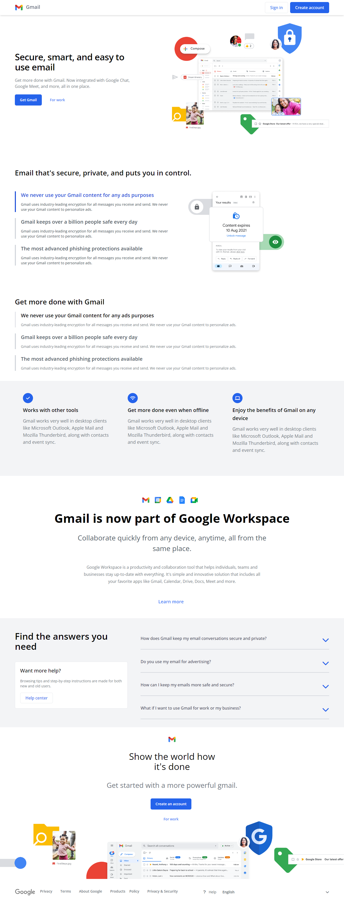

# Gmail Laning Page Design

It was an inpiration to bulid this landing page from gmail's lading page. I have fried a little bit of my skill on tailwind css. This page is built with tailwindcss 🔥🔥🔥
Live Url: https://stalwart-semolina-0bf8df.netlify.app/

## Start the project

1. Clone the repo
2. Run `npm install`
3. Run `npm run watch` and then `npm run start` it will serve the project locally.

## package used

1. `lite-server` : This is for local server
2. `tailwindcss` : You know what, the big boy for this project 🔥

## Live Image

